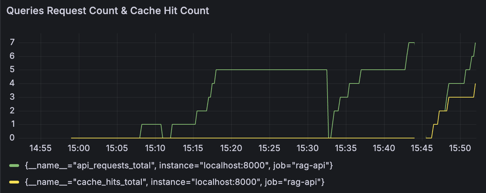

<a name="readme-top"></a>

## About The Project

**Hello, Welcome to Trojan Knowledge!**

This is a production-ready Graph-RAG Q&A system that combines advanced hybrid retrieval with LLM-powered answer generation.

If you need to find reliable answers within dense textbooks or technical documentation, relying solely on AI models like GPT or Gemini can be risky. They often struggle to ingest entire documents accurately or hallucinate locations. **Trojan Knowledge** solves this by identifying the most relevant chunks of text in your documents and feeding them directly into the LLM API for precise, grounded answers.

**Key Use Case:** I used [*Dive into Deep Learning* by Aston Zhang](https://d2l.ai/) for the data pre-processing. If you are studying this book, this tool will be an incredible resource for you.

**Note:** This system also supports offline use cases (like open-book exams) via a direct search method, allowing you to retrieve information without relying on an external API.

**Core Features:**

- **Hybrid Search:** Combines vector search, BM25 keyword matching, and graph-based knowledge expansion.
- **Robust Architecture:** Features multi-layer caching (Memory, Redis, Disk), circuit breakers for resilience, and cross-encoder reranking.
- **Production Ready:** Includes comprehensive monitoring via Prometheus and a FastAPI service with streaming endpoints.


**Homepage Preview:**


**Answer Example:**


**Grafana Monitoring:**




I hope this project saves you valuable time searching through textbooks so you can focus on what truly matters. Fight on! ✌️

<p align="right">(<a href="#readme-top">back to top</a>)</p>

### Built With

* Python
* FastAPI
* PyTorch
* Sentence Transformers
* FAISS
* LangChain
* OpenAI API
* Redis
* Prometheus
* Docker
* PyMuPDF

<p align="right">(<a href="#readme-top">back to top</a>)</p>

<!-- Project Structure -->

## Project Structure

```sh
Graph-RAG-QA-System/
├── Dockerfile                      # Container configuration
├── docker-compose.yml              # Multi-service orchestration
├── requirements.txt                # Python dependencies
├── prometheus.yml                  # Prometheus configuration
├── grafana-dashboard.json          # Grafana dashboard
│                                   # (Need to be created after clone the repo)
├── src/
│   ├── api/
│   │   └── fastapi_app.py          # FastAPI application with endpoints
│   ├── retrieval/
│   │   ├── vector_retriever.py     # FAISS-based semantic search
│   │   ├── bm25_retriever.py       # Keyword-based BM25 search
│   │   ├── hybrid_retriever.py     # Combined retrieval with reranking
│   │   └── graph_retriever.py      # Graph-based knowledge expansion
│   ├── generation/
│   │   ├── llm_generator.py        # OpenAI LLM integration
│   │   └── prompt_templates.py     # System and QA prompts
│   ├── ingestion/
│   │   ├── pdf_processor.py        # PDF text extraction
│   │   └── chunker.py              # Text chunking with LangChain
│   ├── utils/
│   │   ├── cache.py                # Multi-layer caching system
│   │   └── circuit_breaker.py      # Resilience patterns
│   ├── html/
│   │   └── homepage.html           # Web interface
│   └── tests/
│       └── test_performance.py     # Performance testing
├── data/                           # PDF document and processed data storage
├── cache/
│   └── disk/                       # L3 disk cache storage
└── pictures/												# README file pictures
```

<p align="right">(<a href="#readme-top">back to top</a>)</p>

<!-- System Architecture -->

## System Architecture

**Retrieval Pipeline**

1. **Query Processing**: User query is received via API
2. **Hybrid Search**: 
   - Vector search using Sentence Transformers + FAISS
   - BM25 keyword search with custom tokenization
   - Score normalization and weighted combination
3. **Reranking** (optional): Cross-encoder reranking for precision
4. **Graph Expansion** (optional): Multi-hop traversal for context
5. **Caching**: Results cached in L1/L2/L3 layers

**Generation Pipeline**

1. **Context Preparation**: Top-k chunks formatted with sources
2. **Prompt Construction**: System prompt + context + query
3. **LLM Generation**: OpenAI API call with streaming support
4. **Response Formatting**: Answer + sources + metadata
5. **Metrics Collection**: Token usage, latency, success rate

**Data Flow**

```
PDF Documents
    ↓
PDF Processor (PyMuPDF)
    ↓
Text Chunker (LangChain)
    ↓
Embedding Generation (Sentence Transformers)
    ↓
Index Building (FAISS + BM25 + Graph)
    ↓
Query → Hybrid Retrieval → Reranking → Graph Expansion
    ↓
LLM Generation (OpenAI)
    ↓
Answer + Sources
```

<p align="right">(<a href="#readme-top">back to top</a>)</p>

<!-- Architecture Components -->

## Architecture Components

**Hybrid Retrieval System** (`src/retrieval/`)

- **`vector_retriever.py`**: Semantic search using Sentence Transformers and FAISS
  
- **`bm25_retriever.py`**: Keyword-based retrieval
  
- **`hybrid_retriever.py`**: Combined retrieval orchestration
  
- **`graph_retriever.py`**: Knowledge graph expansion

**LLM Generation** (`src/generation/`)

- **`llm_generator.py`**: OpenAI integration for answer generation
  
- **`prompt_templates.py`**: Prompt engineering

**Document Ingestion** (`src/ingestion/`)

- **`pdf_processor.py`**: PDF text extraction
  
- **`chunker.py`**: Intelligent text chunking

**Caching & Resilience** (`src/utils/`)

- **`cache.py`**: Multi-layer caching system
  
- **`circuit_breaker.py`**: Fault tolerance patterns

**API Service** (`src/api/`)

- **`fastapi_app.py`**: Production FastAPI application
  - **Endpoints**:
    - `POST /search`: Hybrid retrieval with optional reranking
    - `POST /ask`: LLM-powered Q&A with sources
    - `POST /ask/stream`: Streaming answer generation
    - `GET /health`: Service health check
    - `GET /metrics`: Prometheus metrics
    - `GET /config`: Model configuration
    - `POST /feature-flags/{flag}`: Dynamic feature toggling

**Monitoring & Observability**

- **Prometheus Metrics**:
  - Request counters by endpoint and status
  - Request duration histograms
  - LLM request tracking by model
  - Token usage counters
  - Error tracking by type
  - Cache hit/miss rates

- **Grafana Dashboard**: Real-time visualization
  - Request rate and latency
  - Error rates and types
  - LLM performance metrics
  - Cache efficiency

**Infrastructure**

- **Docker**: Containerized deployment
  
- **Docker Compose**: Multi-service orchestration

<p align="right">(<a href="#readme-top">back to top</a>)</p>

<!-- Usage -->

## Usage

**Prerequisites**

```bash
pip install -r requirements.txt
```

```bash
mkdir -p data/documents
mkdir -p data/processed_data
```

Place PDF files in `data/documents/`:

```bash
cp /path/to/your/pdfs/*.pdf data/documents/
```

**Environment Setup**

Create a `.env` file with your OpenAI API key, and you can get the API-KEY from [OpenAI Platform](https://platform.openai.com/):

```bash
OPENAI_API_KEY=your_api_key_here 
```

**Start the API Server**

```bash
uvicorn src.api.fastapi_app:app --host 0.0.0.0 --port 8000
```

**Access the API**

- Web Interface: http://localhost:8000
- API Documentation: http://localhost:8000/docs
- Health Check: http://localhost:8000/health
- Metrics: http://localhost:8000/metrics

**Docker Deployment**

```bash
# Start all services (API, Redis, Prometheus, Grafana)
docker-compose up -d

# Check service status
docker-compose ps

# View logs
docker-compose logs -f app

# Stop services
docker-compose down
```

**API Examples**

**Search for relevant documents:**

```bash
curl -X POST "http://localhost:8000/search" \
  -H "Content-Type: application/json" \
  -d '{
    "query": "What is RAG?",
    "k": 5,
    "use_graph": true,
    "use_rerank": true,
    "alpha": 0.5
  }'
```

**Ask a question with LLM-generated answer:**

```bash
curl -X POST "http://localhost:8000/ask" \
  -H "Content-Type: application/json" \
  -d '{
    "query": "Explain how hybrid retrieval works",
    "k": 10,
    "use_graph": true,
    "use_rerank": true,
    "max_context_chunks": 3,
    "model": "gpt-5-nano",
    "temperature": 1
  }'
```

**Stream answer generation:**

```bash
curl -X POST "http://localhost:8000/ask/stream" \
  -H "Content-Type: application/json" \
  -d '{
    "query": "What are the benefits of graph-based retrieval?",
    "k": 10,
    "stream": true
  }'
```

**Toggle feature flags:**

```bash
# Disable reranking
curl -X POST "http://localhost:8000/feature-flags/use_rerank?enabled=false"

# Enable graph retrieval
curl -X POST "http://localhost:8000/feature-flags/use_graph?enabled=true"
```

**Request Parameters**

| Parameter           | Type    | Default      | Description                                    |
| ------------------- | ------- | ------------ | ---------------------------------------------- |
| `query`             | `str`   | Required     | User question or search query                  |
| `k`                 | `int`   | 10           | Number of chunks to retrieve                   |
| `use_graph`         | `bool`  | true         | Enable graph-based expansion                   |
| `use_rerank`        | `bool`  | true         | Enable cross-encoder reranking                 |
| `alpha`             | `float` | 0.5          | Vector/BM25 balance (0=BM25, 1=vector)         |
| `max_context_chunks`| `int`   | 3            | Max chunks to include in LLM context           |
| `model`             | `str`   | gpt-5-nano   | OpenAI model name                              |
| `temperature`       | `float` | 1.0          | LLM sampling temperature                       |
| `stream`            | `bool`  | true         | Enable streaming responses                     |
| `bypass_cache`      | `bool`  | false        | Skip cache lookup                              |

**Response Format**

**Search Response:**

```json
{
  "query": "What is RAG?",
  "results": [
    {
      "chunk_id": "document_c1",
      "text": "RAG stands for Retrieval Augmented Generation...",
      "source": "data/documents/rag_guide.pdf",
      "page_num": 1,
      "score": 0.89
    }
  ],
  "total_results": 5,
  "search_time_ms": 45.2
}
```

**Ask Response:**

```json
{
  "query": "Explain hybrid retrieval",
  "answer": "Hybrid retrieval combines vector search and keyword-based search...",
  "sources": [
    {
      "source": "data/documents/rag_guide.pdf",
      "page_num": 2,
      "chunk_id": "document_c3",
      "score": 0.87,
      "text_preview": "Hybrid retrieval systems leverage both semantic..."
    }
  ],
  "total_sources": 3,
  "retrieval_time_ms": 52.1,
  "generation_time_ms": 1234.5,
  "total_time_ms": 1286.6,
  "model": "gpt-4",
  "tokens_used": 456
}
```

<p align="right">(<a href="#readme-top">back to top</a>)</p>

<!-- Configuration -->

## Configuration

### Retrieval Configuration

**Hybrid Retriever:**

```python
retriever = HybridRetriever(
    alpha=0.5,              # 0.5 = balanced, 0 = BM25 only, 1 = vector only
    use_rerank=True,        # Enable cross-encoder reranking
    use_graph=True          # Enable graph expansion
)
```

**Vector Retriever:**

```python
vector_retriever = VectorRetriever(
    model_name="all-MiniLM-L6-v2"  # Sentence transformer model
)
```

**Graph Retriever:**

```python
graph_retriever = GraphRetriever(
    similarity_threshold=0.7  # Minimum similarity for edge creation
)
```

### Chunking Configuration

```python
chunker = Chunker(
    chunk_size=800,    # Maximum chunk size in characters
    overlap=100        # Overlap between chunks
)
```

### Cache Configuration

```python
cache = MultiLayerCache(
    l1_max_size=1000,        # In-memory cache size
    l2_ttl=3600,             # Redis TTL in seconds
    l3_max_size_mb=100       # Disk cache size limit
)
```

### Circuit Breaker Configuration

```python
search_circuit_breaker = CircuitBreaker(
    failure_threshold=3,     # Failures before opening
    recovery_timeout=30      # Seconds before retry
)

rerank_circuit_breaker = CircuitBreaker(
    failure_threshold=5,
    recovery_timeout=60
)
```

### LLM Configuration

```python
llm_generator = LLMGenerator(
    max_tokens=3000  # Maximum completion tokens
)
```

### Environment Variables

```bash
# Required
OPENAI_API_KEY=your_api_key_here
```

<p align="right">(<a href="#readme-top">back to top</a>)</p>
